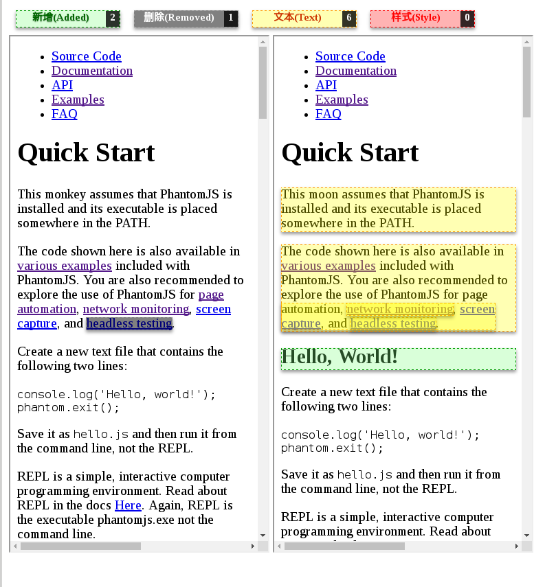

# Online Page Diff

> [page-monitor](https://github.com/fouber/page-monitor) 的在线形式

# 效果



## 使用

```javascript
<script src="/static/js/shjwudp_diff.js"></script>
SHJWUDP_DIFF.showdiff(left_dom, right_dom, legend);
```

left_dom和right_dom是参与比对的两个DOM，legend是可选项，显示比对结果的统计

具体请看demo

demo的使用方法:

> 在demo目录下

> python2:

> ```python2
> python -m SimpleHTTPServer
> ```

> python3:

> ```python3
> python3 -m http.server
> ```

> 打开浏览器访问<http://localhost:8000/>
